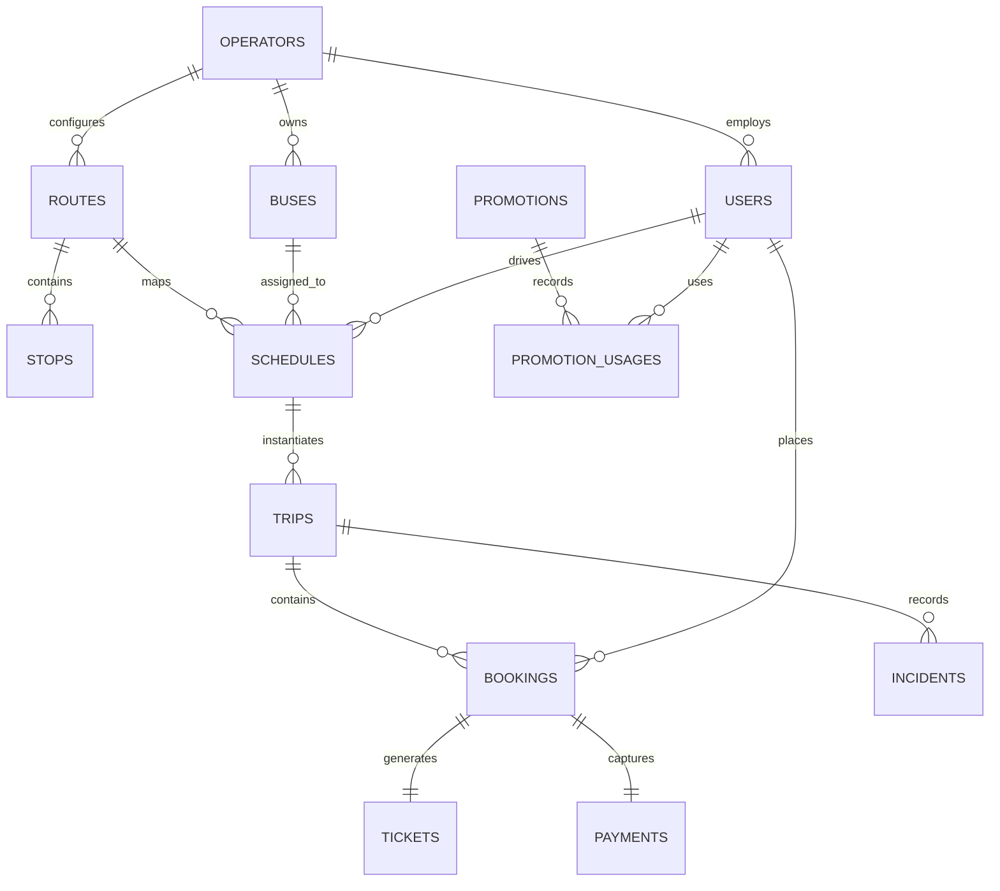

# 🚌 BusExpress — System Specification & Technical Documentation Report

This document serves as the comprehensive System Specification and Technical Documentation Report for **BusExpress**, a full-featured bus booking mobile application built with **Flutter** (Frontend) and **Supabase** (Backend as a Service). It detail-maps all requirements, data architectures, system flows, schemas, testing paradigms, and agile planning documents required for system audit, implementation, and future developments.

---

## 📌 TABLE OF CONTENTS
1. [SYSTEM REQUIREMENTS](#1-system-requirements)
   - [1.1 Functional Requirements (FR)](#11-functional-requirements-fr)
   - [1.2 Non-Functional Requirements (NFR)](#12-non-functional-requirements-nfr)
2. [DATA FLOW DIAGRAMS](#2-data-flow-diagrams)
   - [2.1 Level 1 DFD Architecture](#21-level-1-dfd-architecture)
   - [2.2 Detailed DFD Processes](#22-detailed-dfd-processes)
3. [ENTITY RELATIONSHIP DIAGRAM (ERD)](#3-entity-relationship-diagram-erd)
   - [3.1 Conceptual Model](#31-conceptual-model)
   - [3.2 Mermaid.js Entity Relationships](#32-mermaidjs-entity-relationships)
4. [DATA DICTIONARY](#4-data-dictionary)
5. [USER INTERFACE ARCHITECTURE](#5-user-interface-architecture)
6. [SYSTEM TEST CASES](#6-system-test-cases)
7. [PRODUCT BACKLOG](#7-product-backlog)
8. [SPRINT BACKLOG](#8-sprint-backlog)

---

## 1. SYSTEM REQUIREMENTS

### 1.1 Functional Requirements (FR)
The system satisfies five distinct roles, each equipped with custom dashboards and action boundaries.

```
+---------------------------------------------------------------------------------+
|                                  USER ROLES                                     |
+------------------+------------------+------------------+---------------+--------+
|    Passenger     |      Driver      |    Conductor     |Operator Admin |SuperAdmin|
+------------------+------------------+------------------+---------------+--------+
```

#### 1.1.1 Passenger Requirements
- **FR-PAS-01 (Authentication)**: Register via Email/Password, Login, Logout, and Forgot Password verification link request.
- **FR-PAS-02 (Search Routes)**: Search schedules by matching Route Origin, Destination, and Departure Date.
- **FR-PAS-03 (Schedule Filtering)**: Sort and filter search results by ticket price, departure time, and trip duration.
- **FR-PAS-04 (Interactive Seat Selection)**: Display visual seat grids (e.g. 40-seat layout) marking available vs. reserved seats.
- **FR-PAS-05 (Multi-Seat Booking)**: Reserve single or multiple seats in a single checkout flow.
- **FR-PAS-06 (Ticket Issuance)**: Generate QR-coded tickets containing cryptographically secure validation strings.
- **FR-PAS-07 (Booking Cancellation)**: Cancel reservations with automatic refunds up to a 2-hour cutoff rule prior to departure.
- **FR-PAS-08 (Live Bus Tracking)**: View real-time bus positions moving on a map panel during active trips.
- **FR-PAS-09 (Promotional Discounts)**: Apply active promo codes to checkout flows with automated validation constraints.

#### 1.1.2 Driver Requirements
- **FR-DRI-01 (Trip Dashboard)**: View daily assigned trips, routes, vehicles, and planned schedules.
- **FR-DRI-02 (Trip Lifecycle Control)**: Transition trip status from "Scheduled" to "In Progress" and "Completed" via single-tap controls.
- **FR-DRI-03 (Real-Time Location Broadcast)**: Periodic background GPS broadcast (every 15 seconds) uploading lat/long coordinates.
- **FR-DRI-04 (Passenger Roster)**: Read the passenger manifesto with names, seats, and boarding check statuses.
- **FR-DRI-05 (Incident Reporting)**: Report breakdowns, accidents, or delays with descriptions directly to operator dashboards.

#### 1.1.3 Conductor Requirements
- **FR-CON-01 (Manifest Management)**: View assigned trip manifest and filter passenger listings by *Waiting*, *Boarded*, or *All*.
- **FR-CON-02 (Smart QR Scanning)**: Scan passenger QR tickets using the built-in device camera.
- **FR-CON-03 (Automated Ticket Validation)**: The scanner must auto-verify ticket integrity, checking for:
  - Wrong scheduled trip/date.
  - Ticket already scanned/used.
  - Booking cancelled or expired.
- **FR-CON-04 (Manual Check-In)**: Manually toggle a passenger status to "Boarded" in case of camera failure.

#### 1.1.4 Operator Admin Requirements
- **FR-OPR-01 (Operator Panel)**: Manage operational fleet and staff profiles.
- **FR-OPR-02 (Vehicle Management)**: Complete CRUD (Create, Read, Update, Delete) on buses, tracking active status (`Active`, `Maintenance`, `Retired`).
- **FR-OPR-03 (Route Configuration)**: Configure physical routes, setting origin, destination, distance, and duration.
- **FR-OPR-04 (Schedule Planning)**: Create recurring schedules mapping routes to specific buses, drivers, conductors, times, days of week, and prices.
- **FR-OPR-05 (Staff Provisioning)**: Provision driver and conductor database credentials linked to the operator.

#### 1.1.5 Super Admin Requirements
- **FR-SUP-01 (System-Wide Control)**: Read total active operators, registered users, active trips, and platform revenues.
- **FR-SUP-02 (Operator Management)**: Insert, update, suspend, or reactivate operator companies.
- **FR-SUP-03 (Role Authorization)**: Query, search, and alter role bindings (`driver`, `conductor`, `operator_admin`, `super_admin`) for any registered account.

---

### 1.2 Non-Functional Requirements (NFR)

#### 1.2.1 Security & Compliance (RLS)
- **NFR-SEC-01 (Row-Level Security)**: Database security enforced directly inside Supabase PostgreSQL. Users can query data *only* allowed by their specific RLS profile policy.
  - Passengers can view only *their own* bookings and tickets.
  - Drivers/Conductors can read only *their own* assigned trips and associated bookings.
  - Operator Admins can view/modify only resources corresponding to their company's `operator_id`.
- **NFR-SEC-02 (Secure Connections)**: All communications encrypted via TLS 1.3.

#### 1.2.2 Performance & Responsiveness
- **NFR-PER-01 (GPS Updates)**: Latitude/longitude streams from the driver's device must update database states every 15 seconds.
- **NFR-PER-02 (Map Rendering)**: OpenStreetMap rendering must hold 60 FPS on mid-tier mobile units.
- **NFR-PER-03 (API Latency)**: Supabase database requests must return data in less than 250ms under typical mobile data connections.

#### 1.2.3 Availability & Maintainability
- **NFR-AVL-01 (High Availability)**: Target database availability >= 99.9% supported by Supabase cloud clustering.
- **NFR-MNT-01 (Auto-Completion Service)**: The system auto-completes delayed active trips where scheduled arrival boundaries have passed.

---

## 2. DATA FLOW DIAGRAMS

### 2.1 Level 1 DFD Architecture
The Level 1 Data Flow Diagram traces data transactions across system boundaries, routing entities through internal process blocks to the persistent datastores.

```
       +--------------------+           +--------------------+
       |                    |           |                    |
       |     Passenger      |           |    Super Admin     |
       |                    |           |                    |
       +-----+--------^-----+           +-----+--------^-----+
             |        |                       |        |
    Auth Credentials &|                  Operator Setup|
    Booking Requests  |Tickets, Tracking      |        |Fleet Stats
             |        |                       |        |
       +-----v--------+-----+           +-----v--------+-----+
       |                    |           |                    |
       | 1.0 Authentication |           | 5.0 Fleet &        |
       |   & User Profiles  |           |     Schedules      |
       |                    |           |                    |
       +--------+--^--------+           +--------+--^--------+
                |  |                             |  |
        Read/Write |                             |  | Manage Routes
                |  |                             |  | & Schedules
       +--------v--+--------+           +--------v--+--------+
       |                    |           |                    |
       |     [D1] Users     |           |  [D2] Operators    |
       |                    |           |  [D4] Routes       |
       +--------------------+           |  [D6] Schedules    |
                                        +--------------------+
                                                  |  |
                                                  |  |
       +--------------------+                     |  | Reads
       |                    |                     |  | Schedules
       |     Conductor      |                     |  |
       |                    |                     |  |
       +-----+--------^-----+                     |  |
             |        |                           |  |
         QR Scan &    |Roster Lists               |  |
         Check-in     |                           |  |
             |        |                           |  |
       +-----v--------+-----+           +---------v--v-------+
       |                    |           |                    |
       | 4.0 QR Validation  |           | 2.0 Searching &    |
       |   & Check-In       |           |     Bookings       |
       |                    |           |                    |
       +--------+--^--------+           +--------+--^--------+
                |  |                             |  |
        Scan Logs  |Validate Status      Bookings|  |Available Seats
                |  |                             |  |
       +--------v--+--------+           +--------v--+--------+
       |                    |           |                    |
       |   [D9] Tickets     |           |   [D8] Bookings    |
       |                    |           |                    |
       +--------------------+           +--------------------+
                                                  |  |
                                                  |  |
       +--------------------+                     |  | Selects Trips
       |                    |                     |  |
       |       Driver       |                     |  |
       +-----+--------^-----+                     |  |
             |        |                           |  |
        GPS Location  |Trip Stats                 |  |
             |        |                           |  |
       +-----v--------+-----+                     |  |
       |                    |           +---------v--v-------+
       | 3.0 Real-time GPS  |           |                    |
       |   & Trip Tracking  |<----------+   [D7] Trips       |
       |                    |           |                    |
       +--------+--^--------+           +--------------------+
                |  |
        GPS Coords |Realtime Stream
                |  |
       +--------v--+--------+
       |                    |
       |     [D7] Trips     |
       |                    |
       +--------------------+
```

### 2.2 Detailed DFD Processes

#### 2.2.1 Process 1.0: Authentication & Profile Management
- **Description**: Verifies identity profiles via Supabase Auth and queries detailed system role parameters.
- **Inputs**: Username, email, password, profile details.
- **Outputs**: JWT security tokens, active role permissions.
- **Datastores Referenced**: `[D1] Users`.

#### 2.2.2 Process 2.0: Search, Seat Selection & Booking
- **Description**: Allows passengers to filter routes, choose physical seats, checkout, and book.
- **Inputs**: Journey filters, seat selections, payments.
- **Outputs**: Seat allocations, booking reference IDs.
- **Datastores Referenced**: `[D4] Routes`, `[D6] Schedules`, `[D7] Trips`, `[D8] Bookings`.

#### 2.2.3 Process 3.0: Real-Time GPS Tracking & Trip Updates
- **Description**: Drivers broadcast coordinates during active trips, which are streamed to tracking passengers.
- **Inputs**: Lat/Long coordinates from GPS (15-second cycles).
- **Outputs**: Map markers updates, status triggers.
- **Datastores Referenced**: `[D7] Trips`.

#### 2.2.4 Process 4.0: QR Scan Validation & Boarding Check-In
- **Description**: Conductors scan physical ticket QR codes at boarding gates.
- **Inputs**: QR payload hashes.
- **Outputs**: Scanned records, boarding logs, entry permissions.
- **Datastores Referenced**: `[D9] Tickets`, `[D8] Bookings`.

#### 2.2.5 Process 5.0: Fleet & Schedule Configuration
- **Description**: Company admins declare operational routes, insert schedules, assign vehicles and staff.
- **Inputs**: Plate numbers, routes, times, prices.
- **Outputs**: System schedule tables.
- **Datastores Referenced**: `[D2] Operators`, `[D3] Buses`, `[D4] Routes`, `[D5] Stops`, `[D6] Schedules`.

---

## 3. ENTITY RELATIONSHIP DIAGRAM (ERD)

### 3.1 Conceptual Model
The system uses a highly structured relational database utilizing strict referential integrity.
- An **Operator** operates multiple **Buses**, **Routes**, and employs operational **Users** (drivers/conductors/admins).
- **Routes** consist of a master configuration and multiple sequential transit **Stops**.
- **Schedules** reference an active **Route**, **Bus**, **Driver**, and **Conductor**.
- Each **Trip** is a specific date instance generated from a **Schedule**.
- **Bookings** map a **User** (Passenger) to a designated **Trip** with unique **Seat Numbers**.
- Each completed **Booking** yields a scannable **Ticket** and a **Payment** history object.
- **Incidents** are reported against unique **Trips** by active **Drivers**.
- **Promotions** apply custom rules to **Bookings** and are audited via **Promotion Usages**.

### 3.2 Mermaid.js Entity Relationships
This rendering layout provides a dynamic relational blueprint of the schema:



---

## 4. DATA DICTIONARY

The following structures declare data column characteristics, indexes, and database rules configured in the Supabase instance.

### 4.1 Table: `operators`
Stores details of registered bus transport service companies.
- **Primary Key**: `id`

| Column Name | Data Type | Constraints | Nullable | Description |
|---|---|---|---|---|
| `id` | UUID | PRIMARY KEY, DEFAULT gen_random_uuid() | No | Unique identifier for the operator. |
| `name` | TEXT | UNIQUE, NOT NULL | No | Legal name of the bus operator. |
| `contact` | TEXT | - | Yes | Phone number or official contact email. |
| `status` | TEXT | CHECK (status IN ('active','inactive')) | No | Current operational status of the operator. |
| `created_at`| TIMESTAMPTZ| DEFAULT now() | No | Automated creation timestamp. |

---

### 4.2 Table: `users`
Stores application user data for all roles. Evaluates RLS permission checks.
- **Primary Key**: `id`
- **Foreign Keys**: 
  - `id` references `auth.users(id)` (Cascade)
  - `operator_id` references `operators(id)` (Set Null)

| Column Name | Data Type | Constraints | Nullable | Description |
|---|---|---|---|---|
| `id` | UUID | PRIMARY KEY | No | References the authenticating Supabase user ID. |
| `name` | TEXT | NOT NULL | No | User's full name. |
| `email` | TEXT | UNIQUE, NOT NULL | No | Email address. |
| `phone` | TEXT | - | Yes | Mobile contact number. |
| `role` | TEXT | CHECK (role IN ('passenger', 'driver', 'conductor', 'operator_admin', 'super_admin')) | No | Operational authorization level. |
| `operator_id`| UUID | REFERENCES operators(id) | Yes | Null for passengers/super_admins. |
| `status` | TEXT | CHECK (status IN ('active', 'inactive', 'suspended')) | No | Account status. |
| `created_at`| TIMESTAMPTZ| DEFAULT now() | No | Account creation timestamp. |

---

### 4.3 Table: `buses`
Stores the vehicle assets managed by operators.
- **Primary Key**: `id`
- **Foreign Keys**: `operator_id` references `operators(id)`

| Column Name | Data Type | Constraints | Nullable | Description |
|---|---|---|---|---|
| `id` | UUID | PRIMARY KEY, DEFAULT gen_random_uuid() | No | Unique bus ID. |
| `operator_id`| UUID | REFERENCES operators(id) | No | Owner operator. |
| `plate_number`| TEXT | UNIQUE, NOT NULL | No | License plate of the bus. |
| `model` | TEXT | - | Yes | Vehicle manufacturer model (e.g. Hyundai). |
| `capacity` | INT | CHECK (capacity > 0) | No | Maximum passenger seats. |
| `status` | TEXT | CHECK (status IN ('active', 'maintenance', 'retired')) | No | Current operational status. |
| `created_at`| TIMESTAMPTZ| DEFAULT now() | No | Insertion timestamp. |

---

### 4.4 Table: `routes`
Defines start, end, and expected trip metrics.
- **Primary Key**: `id`
- **Foreign Keys**: `operator_id` references `operators(id)`

| Column Name | Data Type | Constraints | Nullable | Description |
|---|---|---|---|---|
| `id` | UUID | PRIMARY KEY, DEFAULT gen_random_uuid() | No | Unique route identifier. |
| `operator_id`| UUID | REFERENCES operators(id) | No | Managing operator. |
| `name` | TEXT | - | Yes | Route name (e.g., Phnom Penh - Siem Reap). |
| `origin` | TEXT | NOT NULL | No | Starting point. |
| `destination`| TEXT | NOT NULL | No | Terminus. |
| `distance_km`| NUMERIC | CHECK (distance_km > 0) | Yes | Distance in kilometers. |
| `duration_min`| INT | CHECK (duration_min > 0) | Yes | Estimated travel time in minutes. |
| `status` | TEXT | CHECK (status IN ('active', 'inactive')) | No | Active state. |
| `created_at`| TIMESTAMPTZ| DEFAULT now() | No | Creation timestamp. |

---

### 4.5 Table: `stops`
Optionally tracks sequence checkpoints along defined routes.
- **Primary Key**: `id`
- **Foreign Keys**: `route_id` references `routes(id)` (Cascade)

| Column Name | Data Type | Constraints | Nullable | Description |
|---|---|---|---|---|
| `id` | UUID | PRIMARY KEY, DEFAULT gen_random_uuid() | No | Unique stop identifier. |
| `route_id` | UUID | REFERENCES routes(id) | No | Linked master route. |
| `name` | TEXT | NOT NULL | No | Name of the stop waypoint. |
| `arrival_order`| INT | CHECK (arrival_order > 0) | No | Order sequence of the stop. |
| `distance_from_origin_km`| NUMERIC| CHECK (distance_from_origin_km >= 0)| Yes | Distance from the route start. |
| `created_at`| TIMESTAMPTZ| DEFAULT now() | No | Creation timestamp. |

---

### 4.6 Table: `schedules`
Defines recurring departure rules and pricing models.
- **Primary Key**: `id`
- **Foreign Keys**:
  - `route_id` references `routes(id)`
  - `bus_id` references `buses(id)`
  - `driver_id` references `users(id)`
  - `conductor_id` references `users(id)`

| Column Name | Data Type | Constraints | Nullable | Description |
|---|---|---|---|---|
| `id` | UUID | PRIMARY KEY, DEFAULT gen_random_uuid() | No | Unique schedule ID. |
| `route_id` | UUID | REFERENCES routes(id) | No | Target route. |
| `bus_id` | UUID | REFERENCES buses(id) | No | Assigned vehicle. |
| `driver_id` | UUID | REFERENCES users(id) | No | Assigned driver. |
| `conductor_id`| UUID | REFERENCES users(id) | Yes | Assigned conductor. |
| `departure_time`| TIME | NOT NULL | No | Scheduled departure clock. |
| `arrival_time`| TIME | NOT NULL | No | Scheduled arrival clock. |
| `days_of_week`| TEXT | - | No | Weekdays pattern (e.g., '1,2,3,4,5'). |
| `price` | NUMERIC | CHECK (price >= 0) | No | Standard seat ticket price. |
| `status` | TEXT | CHECK (status IN ('active', 'inactive')) | No | Operational state. |
| `created_at`| TIMESTAMPTZ| DEFAULT now() | No | Creation timestamp. |

---

### 4.7 Table: `trips`
Tracks specific daily execution instances of a defined schedule. Receives live telemetry updates.
- **Primary Key**: `id`
- **Foreign Keys**:
  - `schedule_id` references `schedules(id)`
  - `bus_id` references `buses(id)`
  - `driver_id` references `users(id)`

| Column Name | Data Type | Constraints | Nullable | Description |
|---|---|---|---|---|
| `id` | UUID | PRIMARY KEY, DEFAULT gen_random_uuid() | No | Unique trip instance ID. |
| `schedule_id`| UUID | REFERENCES schedules(id) | No | Parent schedule rule. |
| `trip_date` | DATE | NOT NULL | No | Specific date of departure. |
| `bus_id` | UUID | REFERENCES buses(id) | No | Actually assigned vehicle. |
| `driver_id` | UUID | REFERENCES users(id) | No | Assigned operator driver. |
| `status` | TEXT | CHECK (status IN ('scheduled', 'in_progress', 'completed', 'cancelled')) | No | Travel execution phase. |
| `departed_at`| TIMESTAMPTZ| - | Yes | Exact time driver pressed "Start Trip". |
| `arrived_at` | TIMESTAMPTZ| - | Yes | Exact time driver pressed "End Trip". |
| `latitude` | NUMERIC | - | Yes | Real-time GPS Y-coordinate. |
| `longitude` | NUMERIC | - | Yes | Real-time GPS X-coordinate. |
| `created_at`| TIMESTAMPTZ| DEFAULT now() | No | Creation timestamp. |

---

### 4.8 Table: `bookings`
Stores passenger reservations for unique trip dates.
- **Primary Key**: `id`
- **Foreign Keys**:
  - `trip_id` references `trips(id)`
  - `passenger_id` references `users(id)`

| Column Name | Data Type | Constraints | Nullable | Description |
|---|---|---|---|---|
| `id` | UUID | PRIMARY KEY, DEFAULT gen_random_uuid() | No | Unique booking ID. |
| `trip_id` | UUID | REFERENCES trips(id) | No | Scheduled trip instance. |
| `passenger_id`| UUID | REFERENCES users(id) | No | Account of passenger who booked. |
| `seat_number`| TEXT | NOT NULL | No | Seat coordinate selection (e.g. 12B). |
| `status` | TEXT | CHECK (status IN ('confirmed', 'pending', 'boarded', 'cancelled')) | No | State of reservation. |
| `total_price`| NUMERIC | CHECK (total_price >= 0) | No | Paid amount after promotions. |
| `booked_at` | TIMESTAMPTZ| DEFAULT now() | No | Booking registration clock. |
| `booking_channel`| TEXT| CHECK (booking_channel IN ('online', 'counter', 'conductor')) | No | Channel through which booking was made. |
| `created_at`| TIMESTAMPTZ| DEFAULT now() | No | Creation timestamp. |

---

### 4.9 Table: `tickets`
Stores QR credentials containing encrypted validation tokens.
- **Primary Key**: `id`
- **Foreign Keys**:
  - `booking_id` references `bookings(id)` (Cascade)
  - `scanned_by` references `users(id)`

| Column Name | Data Type | Constraints | Nullable | Description |
|---|---|---|---|---|
| `id` | UUID | PRIMARY KEY, DEFAULT gen_random_uuid() | No | Unique ticket identifier. |
| `booking_id` | UUID | REFERENCES bookings(id) | No | Connected seat booking. |
| `qr_code` | TEXT | UNIQUE, NOT NULL | No | Encrypted verification payload hash. |
| `status` | TEXT | CHECK (status IN ('valid', 'used', 'cancelled', 'expired')) | No | Ticket validation status. |
| `scanned_at` | TIMESTAMPTZ| - | Yes | Verification time. |
| `scanned_by` | UUID | REFERENCES users(id) | Yes | Checking conductor ID. |
| `created_at`| TIMESTAMPTZ| DEFAULT now() | No | Issuance timestamp. |

---

### 4.10 Table: `payments`
Tracks monetary transactions for bookings.
- **Primary Key**: `id`
- **Foreign Keys**: `booking_id` references `bookings(id)` (Cascade)

| Column Name | Data Type | Constraints | Nullable | Description |
|---|---|---|---|---|
| `id` | UUID | PRIMARY KEY, DEFAULT gen_random_uuid() | No | Unique transaction ID. |
| `booking_id` | UUID | REFERENCES bookings(id) | No | Linked seat booking. |
| `amount` | NUMERIC | CHECK (amount >= 0) | No | Paid amount. |
| `payment_method`| TEXT | - | Yes | E.g. 'ABA Pay', 'Credit Card', 'Cash'. |
| `status` | TEXT | CHECK (status IN ('paid', 'refunded', 'failed')) | No | Transaction state. |
| `transaction_id`| TEXT| - | Yes | Gateway transaction reference hash. |
| `paid_at` | TIMESTAMPTZ| DEFAULT now() | Yes | Exact processing timestamp. |
| `created_at`| TIMESTAMPTZ| DEFAULT now() | No | Creation timestamp. |

---

### 4.11 Table: `incidents`
Records logs of incidents reported during trips.
- **Primary Key**: `id`
- **Foreign Keys**:
  - `trip_id` references `trips(id)`
  - `reporter_id` references `users(id)`

| Column Name | Data Type | Constraints | Nullable | Description |
|---|---|---|---|---|
| `id` | UUID | PRIMARY KEY, DEFAULT gen_random_uuid() | No | Unique log ID. |
| `trip_id` | UUID | REFERENCES trips(id) | No | Connected trip instance. |
| `reporter_id`| UUID | REFERENCES users(id) | No | Logging driver ID. |
| `incident_type`| TEXT | CHECK (incident_type IN ('breakdown', 'delay', 'accident', 'weather')) | No | Incident category. |
| `description`| TEXT | NOT NULL | No | Detailed logs of the situation. |
| `reported_at`| TIMESTAMPTZ| DEFAULT now() | No | Time recorded. |
| `resolved_at`| TIMESTAMPTZ| - | Yes | Resolution timestamp (null if open). |
| `created_at`| TIMESTAMPTZ| DEFAULT now() | No | Creation timestamp. |

---

### 4.12 Table: `promotions`
Stores codes and constraints for promotional discounts.
- **Primary Key**: `id`

| Column Name | Data Type | Constraints | Nullable | Description |
|---|---|---|---|---|
| `id` | UUID | PRIMARY KEY, DEFAULT gen_random_uuid() | No | Unique promo ID. |
| `code` | TEXT | UNIQUE, NOT NULL | No | Display code (e.g. WELCOME10). |
| `discount_type`| TEXT | CHECK (discount_type IN ('percentage', 'fixed')) | No | Math logic for calculation. |
| `discount_value`| NUMERIC| CHECK (discount_value > 0) | No | Percent value or flat currency amount. |
| `min_purchase`| NUMERIC | CHECK (min_purchase >= 0) | Yes | Minimum pricing checkpoint. |
| `max_usage` | INT | CHECK (max_usage > 0) | Yes | Max global redeems limit. |
| `max_per_user`| INT | CHECK (max_per_user > 0) | Yes | Limit of uses per customer account. |
| `used_count` | INT | DEFAULT 0 | No | Active redeems accumulator. |
| `is_active` | BOOLEAN | DEFAULT true | No | Logical toggle. |
| `expires_at` | TIMESTAMPTZ| - | Yes | End calendar mark. |
| `created_at` | TIMESTAMPTZ| DEFAULT now() | No | Insertion timestamp. |

---

### 4.13 Table: `promotion_usages`
Tracks promotional usage per user.
- **Primary Key**: `id`
- **Foreign Keys**:
  - `promotion_id` references `promotions(id)` (Cascade)
  - `user_id` references `users(id)` (Cascade)

| Column Name | Data Type | Constraints | Nullable | Description |
|---|---|---|---|---|
| `id` | UUID | PRIMARY KEY, DEFAULT gen_random_uuid() | No | Unique log entry ID. |
| `promotion_id`| UUID | REFERENCES promotions(id) | No | Applied promo entity. |
| `user_id` | UUID | REFERENCES users(id) | No | Redeeming user. |
| `used_at` | TIMESTAMPTZ| DEFAULT now() | No | Transaction timeline bookmark. |

---

## 5. USER INTERFACE ARCHITECTURE

The mobile frontend is structured to keep views and actions decoupled across user profiles.

### 5.1 Screens Structure Map
```
lib/features/
├── auth/
│   ├── splash_screen.dart             <-- Root router check
│   ├── login_screen.dart              <-- Credential validator
│   ├── signup_screen.dart             <-- Registration grid
│   └── forgot_password_screen.dart    <-- Password recovery
├── passenger/
│   ├── passenger_main_screen.dart     <-- Bottom Nav Container (Home / Tickets / Profile)
│   ├── passenger_home_screen.dart     <-- Route Searcher & Promotions panel
│   ├── route_list_screen.dart         <-- Schedule search results
│   ├── schedule_seat_screen.dart      <-- Visual seat selector map
│   ├── booking_confirmation_screen.dart <-- Payment & Checkout Screen
│   ├── mytickets_screen.dart          <-- Active/past ticket lists & QR displays
│   ├── live_tracking_screen.dart      <-- Map tracking interface (OpenStreetMap)
│   └── see_all_promotions_screen.dart <-- Lists available coupons
├── driver/
│   ├── driver_home_screen.dart        <-- Today's trips list, logs & stats
│   ├── active_trips.dart              <-- Ongoing trip tracking dashboard
│   ├── driver_trips_screen.dart       <-- Historical/upcoming assigned trips
│   ├── driver_incident_screen.dart    <-- Incident reporting form
│   └── trip_punctuality.dart          <-- Performance metrics
├── conductor/
│   ├── conductor_home_screen.dart     <-- Assigned daily routes
│   ├── conductor_passengers_screen.dart <-- Filterable manifesto roster
│   └── conductor_scanner_screen.dart  <-- Camera scanner (mobile_scanner)
├── operator/
│   ├── operator_home_screen.dart      <-- Dashboard with operational statistics
│   ├── operator_routes_screen.dart    <-- Route configs interface
│   ├── operator_buses_screen.dart     <-- Fleet controls panel
│   ├── operator_schedules_screen.dart <-- Schedule configuration calendars
│   └── operator_staff_screen.dart     <-- Staff management list
└── superAdmin/
    ├── super_admin_home_screen.dart   <-- Global overview statistics
    ├── super_admin_operators_screen.dart <-- Operator licensing CRUD
    └── super_admin_users_screen.dart   <-- User credentials CRUD & role updater
```

### 5.2 Key UI/UX Implementations
- **Map Visualizations**: Custom integration using `flutter_map` with OpenStreetMap. The passenger's client subscribes via `supabase.from('trips').stream(...)` for smooth coordinate transitions.
- **Seat Mapping**: 2D Grid view displaying seat states. Dynamically checks existing bookings (`trips.id` matching `confirmed`/`pending`/`boarded`) to mark nodes as unavailable.
- **Camera Scanning**: Uses `mobile_scanner` with a scanning boundary box and success overlays.

---

## 6. SYSTEM TEST CASES

The following tables document the official verification testing logs for the BusExpress system, grouped by subsystem function.

### 6.1 Function: Authentication
- **Date**: 2026-06-03
- **Test by**: Mr. John
- **Function**: Authentication

| Case ID | Test Scenario | Test Step | Test Data | Expected Result | Actual Result | Status |
|---|---|---|---|---|---|---|
| L01 | Input valid data | 1. Open app<br>2. Enter email<br>3. Enter password<br>4. Click on login button | Email: driver@busexpress.com<br>Password: securePass123 | Navigated to Driver Dashboard | As Expected Result | Pass |
| L02 | Invalid email and valid password | 1. Open app<br>2. Enter email<br>3. Enter password<br>4. Click on Login button | Email: invalid@email.com<br>Password: securePass123 | Invalid email or Password | As Expected Result | Pass |
| L03 | Blank email and blank Password | 1. Open app<br>2. Leave email blank<br>3. Leave password blank<br>4. Click on Login button | Email: (empty)<br>Password: (empty) | Email field is required<br>Password field is required | As Expected Result | Pass |

---

### 6.2 Function: Searching & Scheduling
- **Date**: 2026-06-03
- **Test by**: Mr. John
- **Function**: Searching & Scheduling

| Case ID | Test Scenario | Test Step | Test Data | Expected Result | Actual Result | Status |
|---|---|---|---|---|---|---|
| S01 | Search routes by valid Origin & Destination | 1. Select Origin<br>2. Select Destination<br>3. Select Tomorrow's date<br>4. Tap "Search Routes" | Origin: Phnom Penh<br>Destination: Siem Reap<br>Date: Tomorrow | Returns list of available schedules for route | As Expected Result | Pass |
| S02 | Search routes with no available trips | 1. Select Origin<br>2. Select Destination<br>3. Select future date with no runs<br>4. Tap "Search Routes" | Origin: Phnom Penh<br>Destination: Kep<br>Date: Tomorrow | Displays "No schedules found" message | As Expected Result | Pass |

---

### 6.3 Function: Seat Selection
- **Date**: 2026-06-03
- **Test by**: Mr. John
- **Function**: Seat Selection

| Case ID | Test Scenario | Test Step | Test Data | Expected Result | Actual Result | Status |
|---|---|---|---|---|---|---|
| SE01 | Select available seat | 1. Open visual seat selection map<br>2. Tap on seat "14A"<br>3. Tap "Confirm Selection" | Seat: 14A | Seat is highlighted as selected; seat coordinates display at bottom | As Expected Result | Pass |
| SE02 | Concurrent booking conflict check | 1. User A selects seat 14A<br>2. User B selects seat 14A<br>3. User B completes payment first<br>4. User A attempts to complete payment | Seat: 14A | User A's transaction is blocked; alert displays "Seat is already booked" | As Expected Result | Pass |

---

### 6.4 Function: Booking & Checkout
- **Date**: 2026-06-03
- **Test by**: Mr. John
- **Function**: Booking & Checkout

| Case ID | Test Scenario | Test Step | Test Data | Expected Result | Actual Result | Status |
|---|---|---|---|---|---|---|
| B01 | Complete booking with cash payment | 1. Choose route & seat<br>2. Select payment type "Cash"<br>3. Tap "Complete Booking" | Seat: 04B<br>Payment: Cash | Reservation marked as confirmed; invoice logged; ticket generated | As Expected Result | Pass |

---

### 6.5 Function: Promotions
- **Date**: 2026-06-03
- **Test by**: Mr. John
- **Function**: Promotions

| Case ID | Test Scenario | Test Step | Test Data | Expected Result | Actual Result | Status |
|---|---|---|---|---|---|---|
| P01 | Apply valid coupon code | 1. Input promo code<br>2. Click Apply coupon button | Code: WELCOME10 | Base price total reduced by 10%; final checkout shows correct price | As Expected Result | Pass |
| P02 | Apply coupon with insufficient min purchase | 1. Input promo code<br>2. Click Apply coupon button | Code: FLAT5<br>Base total: $12.00 (min required: $20) | Code rejected; message "Minimum purchase of $20.00 required" | As Expected Result | Pass |

---

### 6.6 Function: Cancellation
- **Date**: 2026-06-03
- **Test by**: Mr. John
- **Function**: Cancellation

| Case ID | Test Scenario | Test Step | Test Data | Expected Result | Actual Result | Status |
|---|---|---|---|---|---|---|
| C01 | Cancel booking before 2-hour cutoff | 1. Go to My Tickets<br>2. Select upcoming ticket<br>3. Tap Cancel Booking<br>4. Confirm cancel | Departure: 5 hours later | Booking status set to cancelled; refund transaction issued | As Expected Result | Pass |
| C02 | Cancel booking after 2-hour cutoff | 1. Go to My Tickets<br>2. Select ticket departing soon<br>3. Tap Cancel Booking | Departure: 1 hour later | Cancellation blocked; error displays "Cancellation not allowed within 2 hours" | As Expected Result | Pass |

---

### 6.7 Function: Live Tracking
- **Date**: 2026-06-03
- **Test by**: Mr. John
- **Function**: Live Tracking

| Case ID | Test Scenario | Test Step | Test Data | Expected Result | Actual Result | Status |
|---|---|---|---|---|---|---|
| T01 | Driver GPS background update | 1. Log in as driver<br>2. Click Start Trip<br>3. Travel along route | Location tracking: ON | Geolocator posts new coordinates to table every 15 seconds | As Expected Result | Pass |
| T02 | Passenger map telemetry sync | 1. Open Live Tracking map<br>2. Observe bus position marker | Trip ID: Active trip | Bus marker shifts position smoothly matching driver coordinates in real time | As Expected Result | Pass |

---

### 6.8 Function: QR Verification
- **Date**: 2026-06-03
- **Test by**: Mr. John
- **Function**: QR Verification

| Case ID | Test Scenario | Test Step | Test Data | Expected Result | Actual Result | Status |
|---|---|---|---|---|---|---|
| Q01 | Conductor scans valid ticket QR | 1. Log in as conductor<br>2. Point scanner at valid QR | QR code payload: Valid UUID | Boarding confirmed; scan logs saved; ticket status updated to used | As Expected Result | Pass |
| Q02 | Scan already-used ticket QR | 1. Scan QR code marked as used | QR code status: used | Scan flashes red; warning "Ticket already used" displays | As Expected Result | Pass |
| Q03 | Scan ticket for wrong trip/date | 1. Scan QR code from different trip | Trip ID mismatch | Warning "Ticket issued for different trip" displays | As Expected Result | Pass |

---

### 6.9 Function: Fleet & Schedule Admin
- **Date**: 2026-06-03
- **Test by**: Mr. John
- **Function**: Fleet & Schedule Admin

| Case ID | Test Scenario | Test Step | Test Data | Expected Result | Actual Result | Status |
|---|---|---|---|---|---|---|
| M01 | Create non-overlapping schedule | 1. Go to schedules admin panel<br>2. Enter details for new run<br>3. Tap Save | Bus: Hyundai Universe<br>Departure: 08:00 AM Mon | Schedule is successfully logged in database and active | As Expected Result | Pass |
| M02 | Create overlapping schedule conflict | 1. Enter details for a second trip<br>2. Tap Save | Bus: Hyundai Universe<br>Departure: 08:30 AM Mon | Operation blocked; alert "Bus already scheduled during this timeframe" | As Expected Result | Pass |
| M03 | Create new bus profile | 1. Go to Buses admin page<br>2. Enter plate, model, capacity<br>3. Click Add | Plate: PP-9999-BB<br>Capacity: 35 | Bus record is saved with status "active" in database | As Expected Result | Pass |

---

### 6.10 Function: Super Admin Controls
- **Date**: 2026-06-03
- **Test by**: Mr. John
- **Function**: Super Admin Controls

| Case ID | Test Scenario | Test Step | Test Data | Expected Result | Actual Result | Status |
|---|---|---|---|---|---|---|
| SA01 | Escalate user role to Operator Admin | 1. Log in as Super Admin<br>2. Edit user role status | Email: staff@op.com<br>New Role: operator_admin | Role updated to operator_admin; user gets dashboard access on next login | As Expected Result | Pass |

---

### 6.11 Function: System Maintenance
- **Date**: 2026-06-03
- **Test by**: Mr. John
- **Function**: System Maintenance

| Case ID | Test Scenario | Test Step | Test Data | Expected Result | Actual Result | Status |
|---|---|---|---|---|---|---|
| SY01 | Auto-Complete Overdue Trips | 1. Allow trip time to pass arrival boundary<br>2. Trigger syncOverdueTrips check | Trip Date: Today<br>Arrival: 1:00 PM (past) | Trip status shifts to completed; arrived_at field is populated | As Expected Result | Pass |

## 7. PRODUCT BACKLOG

**Sprint = 2 weeks | 4 hours × 14 days = 56 hours | Work = 49 hours | Meetings = 7 hours**

**Total Estimation: 266h | Completed: 214h | Remaining: 52h**

### 7.1 Product Backlog Table

| ID | User Story | Est. (h) | Priority | Sprint | Status |
|---|---|---|---|---|---|
| **1. Authentication Module** | | | | | |
| 1 | As a new user, I can register with name, email, phone and password | 8 | High | 1 | Done |
| 2 | As a user, I can log in with email and password | 6 | High | 1 | Done |
| 3 | As a user, I can reset my password via email link | 5 | High | 1 | Done |
| 4 | As the app, I show a splash screen and redirect by role | 4 | Medium | 1 | Done |
| **2. Passenger Module** | | | | | |
| 5 | As a passenger, I can search bus routes by origin, destination and date | 10 | High | 1 | Done |
| 6 | As a passenger, I can view available schedules sorted by price or time | 8 | High | 1 | Done |
| 7 | As a passenger, I can select a seat from a visual bus seat map | 12 | High | 2 | Done |
| 8 | As a passenger, I can confirm booking and receive a QR ticket | 10 | High | 2 | Done |
| 9 | As a passenger, I can view my upcoming and past tickets | 8 | High | 2 | Done |
| 10 | As a passenger, I can cancel a booking (2-hour cutoff rule) | 7 | Medium | 2 | Done |
| 11 | As a passenger, I can track my bus live on a map | 10 | Medium | 2 | Done |
| **3. Driver Module** | | | | | |
| 12 | As a driver, I can view my daily assigned trips | 8 | High | 3 | Done |
| 13 | As a driver, I can start and end my trip | 6 | High | 3 | Done |
| 14 | As a driver, I can broadcast my GPS coordinates | 10 | High | 3 | Done |
| 15 | As a driver, I can report an incident | 8 | Medium | 3 | Done |
| 16 | As a driver, I can view upcoming trips history | 6 | Low | 3 | Done |
| **4. Conductor Module** | | | | | |
| 17 | As a conductor, I can view passenger manifests | 8 | High | 3 | Done |
| 18 | As a conductor, I can validate tickets via QR scanner | 12 | High | 4 | Done |
| 19 | As a conductor, I can manually check in passengers | 6 | Medium | 4 | Done |
| **5. Operator Admin Module** | | | | | |
| 20 | As an operator admin, I can manage routes | 12 | High | 4 | Done |
| 21 | As an operator admin, I can manage buses | 10 | High | 4 | Done |
| 22 | As an operator admin, I can manage staff | 8 | Medium | 4 | Done |
| 23 | As an operator admin, I can schedule trips | 15 | High | 5 | Done |
| **6. Super Admin Module** | | | | | |
| 24 | As a super admin, I can manage operators | 10 | High | 5 | Done |
| 25 | As a super admin, I can manage users and roles | 7 | High | 5 | Done |
| **7. Future Enhancements & Integration Module** | | | | | |
| 26 | As a passenger, I can checkout and pay online using Stripe / local cards | 15 | High | 6 | Open |
| 27 | As a user, I can receive push notifications about trip status | 12 | Medium | 6 | Open |
| 28 | As a passenger, I can review and rate trips and drivers | 10 | Low | 6 | Open |
| 29 | As a passenger, I can apply promo codes for ticket discounts | 15 | Medium | 7 | Open |

---

## 8. SPRINT BACKLOG

The Sprint Backlog contains the detailed task breakdowns and hourly estimates for each development Sprint, verified to never exceed the single-developer limit of **49 hours**.

### 8.1 Sprint 1 Detail (Completed)
- **Goal**: Implement complete authentication flow and route search interface.
- **Sprint Total**: **41 Hours** (Works capacity: 49 Hours).

| ID | Task Breakdown | Est. (h) | Assigned | Status |
|---|---|---|---|---|
| **1** | **As a new user, I can register with name, email, phone and password** | **8** | | |
| | Create registration page layout and inputs validation | 4 | Dev A | Done |
| | Integrate Supabase Auth sign-up endpoints and write profile hook | 4 | Dev A | Done |
| **2** | **As a user, I can log in with email and password** | **6** | | |
| | Build login form page with validation | 3 | Dev A | Done |
| | Map session handling to Flutter secure storage | 3 | Dev A | Done |
| **3** | **As a user, I can reset my password via email link** | **5** | | |
| | Design password reset recovery page | 2 | Dev A | Done |
| | Wire email dispatch handlers using Supabase Auth | 3 | Dev A | Done |
| **4** | **As the app, I show a splash screen and redirect by role** | **4** | | |
| | Design splash logo screen and check local token validity | 2 | Dev A | Done |
| | Implement router check matching user role type from DB | 2 | Dev A | Done |
| **5** | **As a passenger, I can search bus routes by origin, destination and date** | **10** | | |
| | Build route searches UI components | 5 | Dev A | Done |
| | Implement query selectors on Supabase schedules and routes | 5 | Dev A | Done |
| **6** | **As a passenger, I can view available schedules sorted by price or time** | **8** | | |
| | Implement route schedule results list panel | 4 | Dev A | Done |
| | Implement client-side sorting filters | 4 | Dev A | Done |
| | **Total Sprint 1 Allocations** | **41 / 49** | | |

---

### 8.2 Sprint 2 Detail (Completed)
- **Goal**: Build passenger seat mapping, booking checkouts, and maps tracking.
- **Sprint Total**: **47 Hours** (Works capacity: 49 Hours).

| ID | Task Breakdown | Est. (h) | Assigned | Status |
|---|---|---|---|---|
| **7** | **As a passenger, I can select a seat from a visual bus seat map** | **12** | | |
| | Construct 2D visual seat grid layout | 6 | Dev A | Done |
| | Check existing seat reservations matching target trip | 6 | Dev A | Done |
| **8** | **As a passenger, I can confirm booking and receive a QR ticket** | **10** | | |
| | Add confirm booking UI and checkout summary sheet | 4 | Dev A | Done |
| | Implement ticket QR generation using qr_flutter library | 6 | Dev A | Done |
| **9** | **As a passenger, I can view my upcoming and past tickets** | **8** | | |
| | Build my-tickets screen with tab selectors | 4 | Dev A | Done |
| | Query passenger bookings table joined with trip coordinates | 4 | Dev A | Done |
| **10** | **As a passenger, I can cancel a booking (2-hour cutoff rule)** | **7** | | |
| | Implement Cancel Booking bottom sheet dialog | 3 | Dev A | Done |
| | Implement 2-hour duration check database function | 4 | Dev A | Done |
| **11** | **As a passenger, I can track my bus live on a map** | **10** | | |
| | Set up OpenStreetMap container via flutter_map | 5 | Dev A | Done |
| | Subscribe to Supabase Realtime channel for live trip coords | 5 | Dev A | Done |
| | **Total Sprint 2 Allocations** | **47 / 49** | | |

---

### 8.3 Sprint 3 Detail (Completed)
- **Goal**: Implement driver shift portals, incident logs, manifests, and location broadcasts.
- **Sprint Total**: **46 Hours** (Works capacity: 49 Hours).

| ID | Task Breakdown | Est. (h) | Assigned | Status |
|---|---|---|---|---|
| **12** | **As a driver, I can view my daily assigned trips** | **8** | | |
| | Build driver homepage showing assigned route schedules | 4 | Dev A | Done |
| | Implement calendar checks filter queries | 4 | Dev A | Done |
| **13** | **As a driver, I can start and end my trip** | **6** | | |
| | Add Start/End trip action handlers and update trip status | 3 | Dev A | Done |
| | Implement trip duration calculations | 3 | Dev A | Done |
| **14** | **As a driver, I can broadcast my GPS coordinates** | **10** | | |
| | Setup background geolocation background service | 5 | Dev A | Done |
| | Periodic post coordinate data (every 15 seconds) to trips | 5 | Dev A | Done |
| **15** | **As a driver, I can report an incident** | **8** | | |
| | Design incident declaration entry form page | 4 | Dev A | Done |
| | Write incident log DB insertion queries | 4 | Dev A | Done |
| **16** | **As a driver, I can view upcoming trips history** | **6** | | |
| | Add driver upcoming shifts overview screen | 3 | Dev A | Done |
| | Query future schedule rows for driver | 3 | Dev A | Done |
| **17** | **As a conductor, I can view passenger manifests** | **8** | | |
| | Design passenger manifest checklist page | 4 | Dev A | Done |
| | Write manifest filtering parameters | 4 | Dev A | Done |
| | **Total Sprint 3 Allocations** | **46 / 49** | | |

---

### 8.4 Sprint 4 Detail (Completed)
- **Goal**: Ticket verification scans, routes, buses, and staff configuration panels.
- **Sprint Total**: **48 Hours** (Works capacity: 49 Hours).

| ID | Task Breakdown | Est. (h) | Assigned | Status |
|---|---|---|---|---|
| **18** | **As a conductor, I can validate tickets via QR scanner** | **12** | | |
| | Setup mobile_scanner camera scanning layout | 6 | Dev A | Done |
| | Write ticket check security algorithms (wrong date, trip, scanned) | 6 | Dev A | Done |
| **19** | **As a conductor, I can manually check in passengers** | **6** | | |
| | Implement manifest check manual check-in toggle button | 3 | Dev A | Done |
| | Write updates to bookings status to set to boarded | 3 | Dev A | Done |
| **20** | **As an operator admin, I can manage routes** | **12** | | |
| | Build admin routes management UI list and configuration forms | 6 | Dev A | Done |
| | Write insert/update database functions for routes | 6 | Dev A | Done |
| **21** | **As an operator admin, I can manage buses** | **10** | | |
| | Design bus list overview showing model/capacity status | 5 | Dev A | Done |
| | Write validations for active/maintenance plates statuses | 5 | Dev A | Done |
| **22** | **As an operator admin, I can manage staff** | **8** | | |
| | Add staff management tab listing drivers/conductors | 4 | Dev A | Done |
| | Implement staff credentials assignment triggers | 4 | Dev A | Done |
| | **Total Sprint 4 Allocations** | **48 / 49** | | |

---

### 8.5 Sprint 5 Detail (Completed)
- **Goal**: Fleet schedule calendars planning, operator verification, and super-admin panels.
- **Sprint Total**: **32 Hours** (Works capacity: 49 Hours).

| ID | Task Breakdown | Est. (h) | Assigned | Status |
|---|---|---|---|---|
| **23** | **As an operator admin, I can schedule trips** | **15** | | |
| | Design schedule grid matrix for trips | 7 | Dev A | Done |
| | Write schedule validations to block resource overlap conflicts | 8 | Dev A | Done |
| **24** | **As a super admin, I can manage operators** | **10** | | |
| | Build super-admin operators dashboard | 5 | Dev A | Done |
| | Write status suspend/activate handlers for operators accounts | 5 | Dev A | Done |
| **25** | **As a super admin, I can manage users and roles** | **7** | | |
| | Build users search and filter profile panels | 3 | Dev A | Done |
| | Implement role change update triggers | 4 | Dev A | Done |
| | **Total Sprint 5 Allocations** | **32 / 49** | | |

---

### 8.6 Sprint 6 Detail (Planned / Open)
- **Goal**: Integrate online payment gateway, push notifications engine, and reviews.
- **Sprint Total**: **37 Hours** (Works capacity: 49 Hours).

| ID | Task Breakdown | Est. (h) | Assigned | Status |
|---|---|---|---|---|
| **26** | **As a passenger, I can checkout and pay online using Stripe / local cards** | **15** | | |
| | Setup Stripe SDK on frontend client | 7 | Dev A | Open |
| | Write payment confirmation webhook handlers in backend | 8 | Dev A | Open |
| **27** | **As a user, I can receive push notifications about trip status** | **12** | | |
| | Connect Firebase Cloud Messaging (FCM) package | 6 | Dev A | Open |
| | Implement push triggers on DB incident insertion | 6 | Dev A | Open |
| **28** | **As a passenger, I can review and rate trips and drivers** | **10** | | |
| | Build driver rating star component on ticket overview | 5 | Dev A | Open |
| | Create driver reviews database table and average calculator | 5 | Dev A | Open |
| | **Total Sprint 6 Allocations** | **37 / 49** | | |

---

### 8.7 Sprint 7 Detail (Planned / Open)
- **Goal**: Implement dynamic promo code validations rules engine.
- **Sprint Total**: **15 Hours** (Works capacity: 49 Hours).

| ID | Task Breakdown | Est. (h) | Assigned | Status |
|---|---|---|---|---|
| **29** | **As a passenger, I can apply promo codes for ticket discounts** | **15** | | |
| | Design coupon code entry textfield inside booking details | 4 | Dev A | Open |
| | Build backend checks for limits and min-purchase validation | 11 | Dev A | Open |
| | **Total Sprint 7 Allocations** | **15 / 49** | | |
